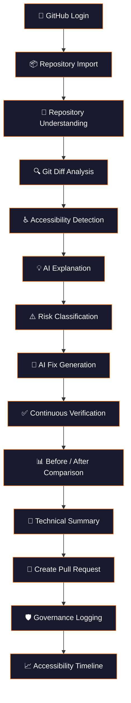
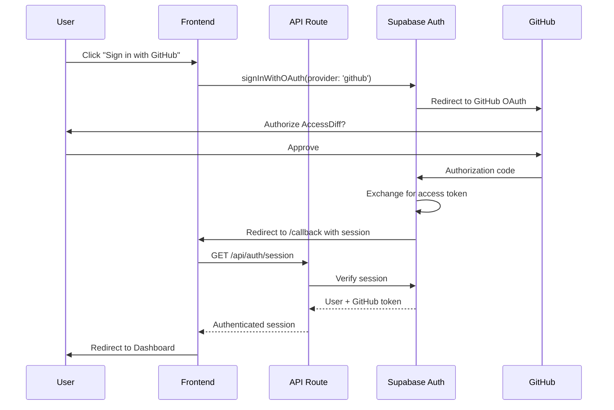
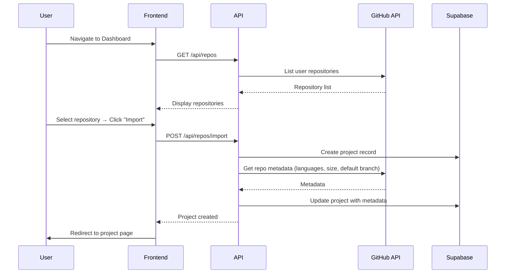
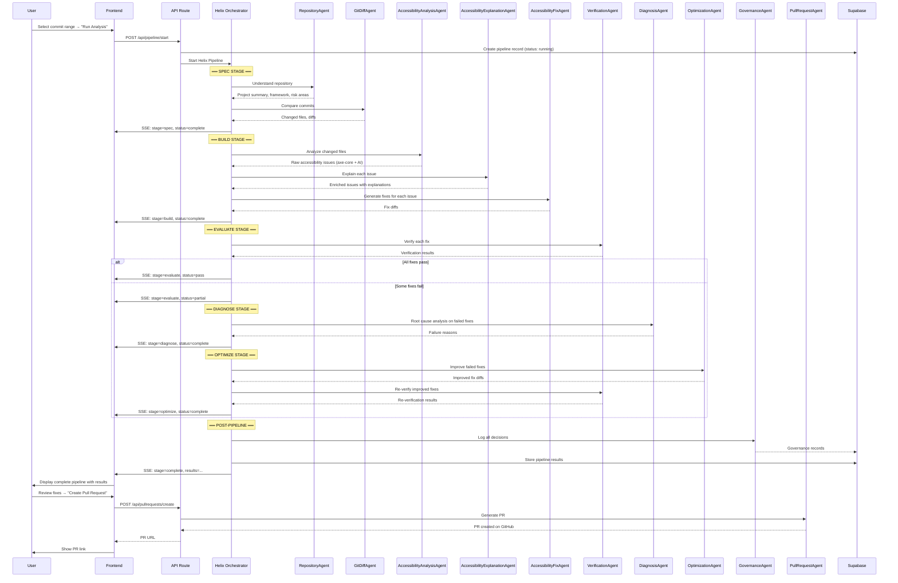
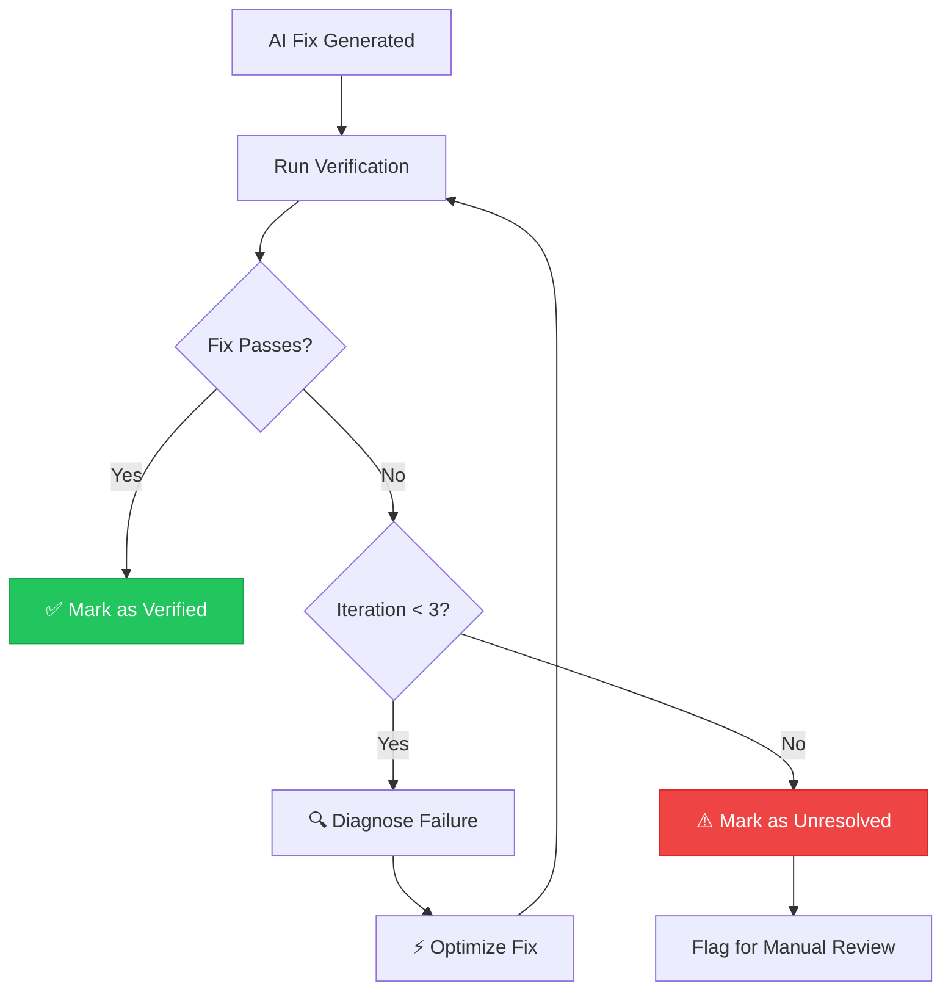
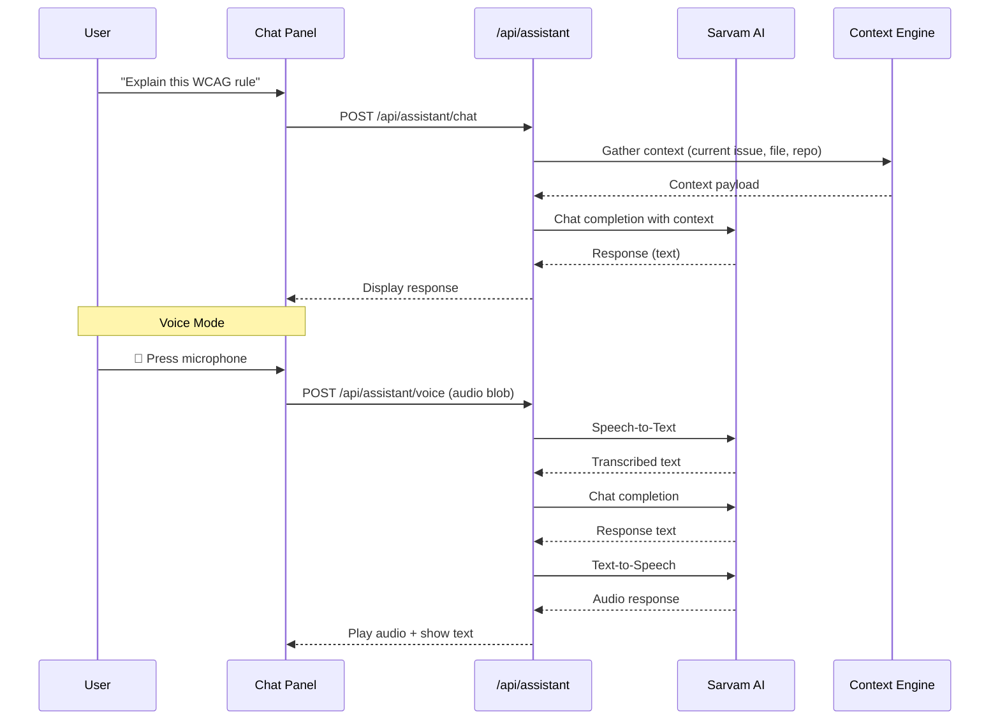
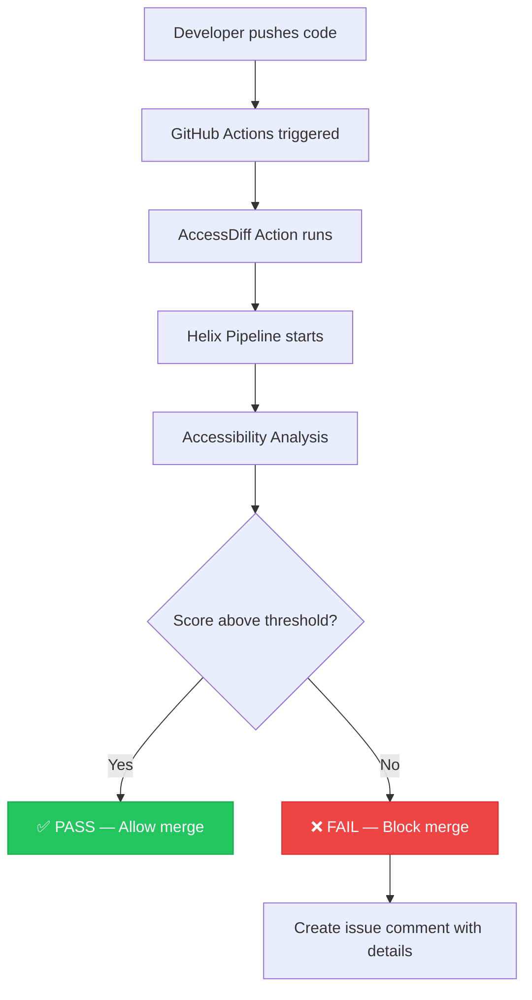

# AccessDiff — Application Flow

> Complete user journey and system interaction diagrams

---

## 1. High-Level User Flow



This pipeline is presented as **ONE continuous flow** in the frontend. Each stage is an expandable card that shows detailed information as it completes. Users always know which stage is currently active.

---

## 2. Detailed Flow: Authentication & Onboarding



### Post-Auth State

After authentication, the system stores:
- Supabase session (cookie-based)
- GitHub OAuth token (encrypted in Supabase `users` table)
- User profile (avatar, name, GitHub username)

---

## 3. Detailed Flow: Repository Import



---

## 4. Detailed Flow: Accessibility Pipeline

This is the core workflow. It maps directly to the Mutagent Helix ADL lifecycle.



---

## 5. Detailed Flow: Verification Loop



---

## 6. Page-by-Page Application Flow

### 6.1 Landing Page (`/`)

```
┌─────────────────────────────────────────────────────┐
│  AccessDiff                              [Sign In]  │
│─────────────────────────────────────────────────────│
│                                                      │
│     AI Accessibility Copilot for GitHub              │
│                                                      │
│     [Get Started with GitHub →]                      │
│                                                      │
│  ┌──────────┐  ┌──────────┐  ┌──────────┐          │
│  │Regression│  │AI Fixes  │  │Governance│          │
│  │Detection │  │& Verify  │  │& Trust   │          │
│  └──────────┘  └──────────┘  └──────────┘          │
│                                                      │
│  [Pipeline Demo Animation]                           │
│                                                      │
└─────────────────────────────────────────────────────┘
```

- Hero section with product tagline
- Feature cards with animations
- Live demo preview of the pipeline
- CTA: Sign in with GitHub

### 6.2 Dashboard (`/dashboard`)

```
┌──────┬──────────────────────────────────────────────┐
│      │  Dashboard                           [user]  │
│  S   │──────────────────────────────────────────────│
│  I   │                                              │
│  D   │  Your Projects                               │
│  E   │  ┌────────────────────────────────────────┐  │
│  B   │  │ repo-name          Score: 87    [View] │  │
│  A   │  │ Last scan: 2h ago  Issues: 3           │  │
│  R   │  └────────────────────────────────────────┘  │
│      │  ┌────────────────────────────────────────┐  │
│      │  │ another-repo       Score: 92    [View] │  │
│      │  │ Last scan: 1d ago  Issues: 1           │  │
│      │  └────────────────────────────────────────┘  │
│      │                                              │
│      │  [+ Import Repository]                       │
│      │                                              │
└──────┴──────────────────────────────────────────────┘
```

- Sidebar navigation (persistent)
- Project cards with accessibility scores
- Quick stats (total issues, improvement trend)
- Import new repository button

### 6.3 Project Pipeline (`/project/[id]/pipeline`)

```
┌──────┬──────────────────────────────────────────────┐
│      │  project-name / Pipeline             [user]  │
│  S   │──────────────────────────────────────────────│
│  I   │  Commit: abc123 → def456                     │
│  D   │                                              │
│  E   │  ┌─ ✅ Repository Understanding ──────────┐  │
│  B   │  │  Framework: Next.js 14                  │  │
│  A   │  │  Components: 47  Forms: 12  Pages: 8    │  │
│  R   │  │  Risk Areas: Navigation, Forms, Modal   │  │
│      │  └─────────────────────────────────────────┘  │
│      │                                              │
│      │  ┌─ ✅ Git Diff Analysis ─────────────────┐  │
│      │  │  Files Changed: 5                       │  │
│      │  │  A11y-Relevant: 3                       │  │
│      │  └─────────────────────────────────────────┘  │
│      │                                              │
│      │  ┌─ 🔄 Accessibility Detection ───────────┐  │
│      │  │  ████████░░ 80%                         │  │
│      │  │  Scanning: src/components/Modal.tsx      │  │
│      │  └─────────────────────────────────────────┘  │
│      │                                              │
│      │  ┌─ ⏳ AI Explanation ────────────────────┐  │
│      │  │  Waiting...                             │  │
│      │  └─────────────────────────────────────────┘  │
│      │                                              │
│      │  ... (remaining stages)                      │
│      │                                              │
│      │  [💬 Ask AI Assistant]                       │
│      │                                              │
└──────┴──────────────────────────────────────────────┘
```

- Continuous vertical pipeline view
- Each stage is an expandable card
- Active stage shows progress bar and current activity
- Completed stages show summary results
- Pending stages show "Waiting..."
- Real-time updates via SSE

### 6.4 Repository Explorer (`/project/[id]/explorer`)

```
┌──────┬──────────────────────────────────────────────┐
│      │  project-name / Explorer             [user]  │
│  S   │──────────────────────────────────────────────│
│  I   │  ┌──────────┬───────────────────────────────┐│
│  D   │  │ 📁 src   │  // Modal.tsx                 ││
│  E   │  │  📁 comp │                               ││
│  B   │  │   📄 But │  export function Modal() {    ││
│  A   │  │   📄 Mod │    return (                   ││
│  R   │  │   📄 Nav │ ⚠  <div onClick={close}>     ││
│      │  │  📁 pages│        {children}              ││
│      │  │  📁 lib  │      </div>                   ││
│      │  │          │    );                          ││
│      │  │          │  }                             ││
│      │  │          │                               ││
│      │  │          │  ──────────────────────────── ││
│      │  │          │  ⚠ Line 5: div with onClick  ││
│      │  │          │  requires keyboard handler    ││
│      │  │          │  WCAG 2.1.1  Severity: Major ││
│      │  └──────────┴───────────────────────────────┘│
└──────┴──────────────────────────────────────────────┘
```

- Left panel: file tree with issue indicators
- Right panel: code viewer (Monaco Editor)
- Inline issue annotations on affected lines
- Issue detail panel below code

### 6.5 Issue Detail View

```
┌──────────────────────────────────────────────────────┐
│  Issue: Missing keyboard handler on interactive div  │
│──────────────────────────────────────────────────────│
│                                                      │
│  📍 File: src/components/Modal.tsx  Line: 5          │
│  ⚠️  Severity: Major    🎯 Confidence: 92%          │
│  📋 WCAG: 2.1.1 Keyboard                            │
│                                                      │
│  ┌─ Trust Score ─────────────────────────────────┐   │
│  │  Score: 88/100  ✅ Verified  🔄 Rollback      │   │
│  └───────────────────────────────────────────────┘   │
│                                                      │
│  ┌─ Explanation ─────────────────────────────────┐   │
│  │  Technical: The <div> element uses onClick    │   │
│  │  but has no onKeyDown/onKeyUp handler...      │   │
│  │                                               │   │
│  │  Impact: Keyboard-only users cannot interact  │   │
│  │  with this modal close button...              │   │
│  │                                               │   │
│  │  Business: ~15% of users rely on keyboard     │   │
│  │  navigation. This blocks modal dismissal...   │   │
│  └───────────────────────────────────────────────┘   │
│                                                      │
│  ┌─ Fix ──── Before ──── │ ──── After ────────────┐  │
│  │  - <div onClick={c}>  │ + <button onClick={c}> │  │
│  │  -   {children}       │ +   {children}         │  │
│  │  - </div>             │ + </button>            │  │
│  └───────────────────────────────────────────────┘   │
│                                                      │
│  [✅ Approve Fix]  [❌ Reject]  [🔄 Rollback]       │
│                                                      │
└──────────────────────────────────────────────────────┘
```

### 6.6 Governance Log (`/project/[id]/governance`)

```
┌──────┬──────────────────────────────────────────────┐
│      │  project-name / Governance           [user]  │
│  S   │──────────────────────────────────────────────│
│  I   │                                              │
│  D   │  AI Decision Audit Trail                     │
│  E   │                                              │
│  B   │  ┌────────────────────────────────────────┐  │
│  A   │  │ 🕐 12:34:05  AccessibilityFixAgent     │  │
│  R   │  │ Action: Generated fix for Modal.tsx:5   │  │
│      │  │ Confidence: 92%  Trust: 88              │  │
│      │  │ Reasoning: Interactive div → button     │  │
│      │  │ Verification: ✅ Passed                 │  │
│      │  │ Status: Approved by developer           │  │
│      │  │ [View Before] [View After] [Rollback]   │  │
│      │  └────────────────────────────────────────┘  │
│      │                                              │
│      │  ┌────────────────────────────────────────┐  │
│      │  │ 🕐 12:33:58  VerificationAgent         │  │
│      │  │ Action: Verified fix passes axe-core    │  │
│      │  │ Confidence: 95%  Trust: 91              │  │
│      │  │ ...                                     │  │
│      │  └────────────────────────────────────────┘  │
│      │                                              │
└──────┴──────────────────────────────────────────────┘
```

### 6.7 Accessibility Timeline (`/project/[id]/timeline`)

```
┌──────┬──────────────────────────────────────────────┐
│      │  project-name / Timeline             [user]  │
│  S   │──────────────────────────────────────────────│
│  I   │                                              │
│  D   │  Accessibility Score Over Time               │
│  E   │                                              │
│  B   │  100 ┤                          ╱──●         │
│  A   │   90 ┤              ╱──●───●──╱              │
│  R   │   80 ┤    ●───●──╱╱                          │
│      │   70 ┤  ╱                                    │
│      │   60 ┤╱                                      │
│      │      ├──┬──┬──┬──┬──┬──┬──┬──┬──             │
│      │      Jan  Feb  Mar  Apr  May  Jun             │
│      │                                              │
│      │  Recent Commits                              │
│      │  ┌──────────────────────────────────────┐    │
│      │  │ abc123  +3 issues  -5 issues  ↑ 92   │    │
│      │  │ def456  +1 issue   -2 issues  ↑ 87   │    │
│      │  └──────────────────────────────────────┘    │
│      │                                              │
└──────┴──────────────────────────────────────────────┘
```

---

## 7. Sarvam AI Assistant Flow

The assistant is a floating panel accessible from any page.



### Contextual Awareness

The assistant knows:
- Which repository the user is viewing
- Which file is open
- Which issue is selected
- The current pipeline status
- The user's language preference

---

## 8. CI/CD Integration Flow



### GitHub Actions YAML (generated for users)

```yaml
name: AccessDiff Accessibility Check
on:
  pull_request:
    branches: [main]

jobs:
  accessibility:
    runs-on: ubuntu-latest
    steps:
      - uses: actions/checkout@v4
      - name: Run AccessDiff
        uses: accessdiff/action@v1
        with:
          api-key: ${{ secrets.ACCESSDIFF_API_KEY }}
          threshold: 80
          fail-on-regression: true
```

---

## 9. State Management

### Frontend State Architecture

```
Application State
├── Auth State (Supabase session — cookie-based)
├── Project State (selected project, repo data)
├── Pipeline State (SSE-driven, real-time updates)
│   ├── Current stage
│   ├── Stage results
│   ├── Issues found
│   └── Fixes generated
├── UI State (sidebar open, active tab, modals)
└── Assistant State (chat history, voice recording)
```

- **Auth:** Managed by Supabase client SDK (persisted in cookies)
- **Server Data:** Fetched via React Server Components where possible, or SWR/fetch for client components
- **Pipeline:** SSE-driven state via `useSSE` custom hook
- **UI:** React `useState` / `useReducer` (no global state library needed)

---

## 10. Error Handling Strategy

| Scenario | User Experience |
|---|---|
| GitHub API rate limit | "GitHub rate limit reached. Retry in X minutes." |
| Groq API timeout | "AI analysis taking longer than expected. Retrying..." |
| Pipeline stage failure | Stage card shows error with retry button |
| Network disconnect | Toast: "Connection lost. Reconnecting..." |
| Supabase auth expired | Redirect to login with "Session expired" message |
| Verification loop exhausted | "Fix could not be verified after 3 attempts. Flagged for manual review." |

---

*Document Version: 1.0*
*Last Updated: 2026-08-04*
*Status: DRAFT — Awaiting Review*
