# AccessDiff — Implementation Plan

> Phased implementation roadmap with dependencies, deliverables, and verification criteria

---

## Overview

Implementation follows a strict sequential phase approach. Each phase must be:

1. **Completed** — All deliverables working
2. **Verified** — Tests pass, UI renders, integrations function
3. **Documented** — Tracker.md and Memory.md updated

Only then does the next phase begin. No jumping between phases.

---

## Phase Map

```mermaid
flowchart LR
    P0["Phase 0\nProject Setup"] --> P1["Phase 1\nDesign System"]
    P1 --> P2["Phase 2\nAuth & Layout"]
    P2 --> P3["Phase 3\nRepo Import"]
    P3 --> P4["Phase 4\nAgent Foundation"]
    P4 --> P5["Phase 5\nAccessibility Pipeline"]
    P5 --> P6["Phase 6\nUI: Pipeline & Issues"]
    P6 --> P7["Phase 7\nFixes & Verification"]
    P7 --> P8["Phase 8\nGovernance & Trust"]
    P8 --> P9["Phase 9\nRepo Explorer & Diffs"]
    P9 --> P10["Phase 10\nPR & Timeline"]
    P10 --> P11["Phase 11\nSarvam Assistant"]
    P11 --> P12["Phase 12\nExperience Mode"]
    P12 --> P13["Phase 13\nCI/CD & Landing"]
    P13 --> P14["Phase 14\nPolish & A11y Audit"]
```

---

## Phase 0 — Project Setup

**Goal:** Initialize the project with all dependencies and configuration.

### Deliverables

| # | Task | Details |
|---|---|---|
| 0.1 | Initialize Next.js 16 (App Router, TypeScript) | `npx create-next-app@latest` with App Router |
| 0.2 | Install all dependencies | See TRD.md for complete list |
| 0.3 | Configure TypeScript | Strict mode, path aliases |
| 0.4 | Set up project structure | Match TRD.md folder structure |
| 0.5 | Create `.env.local.example` | All required environment variables |
| 0.6 | Set up Supabase project | Create project, enable GitHub auth provider |
| 0.7 | Run initial database migration | All tables from Schema.md |
| 0.8 | Verify build compiles | `npm run build` succeeds |

### Verification
- `npm run dev` starts without errors
- `npm run build` completes successfully
- TypeScript compilation has zero errors

---

## Phase 1 — Design System

**Goal:** Implement the complete design system as CSS and base components.

### Deliverables

| # | Task | Details |
|---|---|---|
| 1.1 | Create `globals.css` | Reset, base styles |
| 1.2 | Create `tokens.css` | All CSS custom properties from Design.md |
| 1.3 | Create `typography.css` | Font loading, type scale |
| 1.4 | Create `animations.css` | Transition tokens, keyframes |
| 1.5 | Load fonts | Plus Jakarta Sans, JetBrains Mono (Google Fonts), Talina, Gunken (self-hosted) |
| 1.6 | Build `Button` component | All variants, sizes, states |
| 1.7 | Build `Card` component | Default + glass variant |
| 1.8 | Build `Badge` component | Severity badges, status badges |
| 1.9 | Build `Input` component | Text, search variants with labels |
| 1.10 | Build `Modal` component | Accessible modal with focus trap |
| 1.11 | Build `Toast` component | Notification toasts with auto-dismiss |
| 1.12 | Build `Skeleton` component | Loading placeholder |

### Verification
- All components render correctly in isolation
- Focus indicators visible on all interactive elements
- Color contrast meets WCAG AA
- Reduced motion preference respected

---

## Phase 2 — Authentication & Layout

**Goal:** GitHub OAuth login and authenticated layout shell.

### Deliverables

| # | Task | Details |
|---|---|---|
| 2.1 | Supabase client setup | `lib/supabase/client.ts` and `lib/supabase/server.ts` |
| 2.2 | Auth middleware | Redirect unauthenticated users to login |
| 2.3 | Login page | GitHub OAuth button, branding |
| 2.4 | Auth callback handler | Process OAuth redirect |
| 2.5 | Build `Sidebar` component | Navigation links, user avatar, collapse/expand |
| 2.6 | Build `Header` component | Breadcrumbs, user menu |
| 2.7 | Authenticated layout | Sidebar + Header + Main content area |
| 2.8 | Logout functionality | Clear session, redirect to login |

### Verification
- Can sign in with GitHub and reach dashboard
- Session persists across page refreshes
- Unauthenticated users redirected to login
- Sidebar navigation works with keyboard
- Layout responsive at all breakpoints

---

## Phase 3 — Repository Import & Understanding

**Goal:** Import GitHub repos and run AI repository analysis.

### Deliverables

| # | Task | Details |
|---|---|---|
| 3.1 | GitHub API client | `lib/github/client.ts` with token-based auth |
| 3.2 | List user repos API | `GET /api/repos` — fetch from GitHub |
| 3.3 | Import repo API | `POST /api/repos/import` — store in Supabase |
| 3.4 | Repository list UI | Card grid with search/filter |
| 3.5 | Groq client setup | `lib/groq/client.ts` |
| 3.6 | `RepositoryAgent` | Analyze repo structure, detect framework, risk areas |
| 3.7 | Project detail page | Display AI summary, framework, risk areas |
| 3.8 | Dashboard page | List imported projects with scores |

### Verification
- Can list GitHub repos after login
- Can import a repo (stored in Supabase)
- RepositoryAgent generates meaningful summary
- Project page displays all analysis results

---

## Phase 4 — Agent Foundation (Mutagent Helix)

**Goal:** Set up Helix orchestrator and define all agent skills.

### Deliverables

| # | Task | Details |
|---|---|---|
| 4.1 | Mutagent SDK setup | Initialize `@mutagent/sdk` |
| 4.2 | Helix orchestrator | `agents/helix.ts` — ADL pipeline definition |
| 4.3 | Agent base interface | Typed interface for all agents |
| 4.4 | `GitDiffAgent` | Compare commits, extract diffs via GitHub API |
| 4.5 | `AccessibilityAnalysisAgent` | Run axe-core analysis on code |
| 4.6 | `AccessibilityExplanationAgent` | Enrich issues with AI explanations |
| 4.7 | `AccessibilityFixAgent` | Generate minimal diffs |
| 4.8 | `VerificationAgent` | Re-run analysis on fixed code |
| 4.9 | `DiagnosisAgent` | Root cause analysis for failed fixes |
| 4.10 | `OptimizationAgent` | Improve failed fixes |
| 4.11 | `GovernanceAgent` | Record audit logs |
| 4.12 | `PullRequestAgent` | Generate GitHub PRs |

### Verification
- Helix can run a complete SPEC → BUILD → EVALUATE pipeline
- Each agent produces well-structured output
- Agents chain correctly (output of one feeds into next)
- Governance logs are created for each decision

---

## Phase 5 — Accessibility Pipeline (Backend)

**Goal:** Wire up the complete accessibility analysis pipeline as an API.

### Deliverables

| # | Task | Details |
|---|---|---|
| 5.1 | Pipeline start API | `POST /api/pipeline/start` |
| 5.2 | Pipeline status API | `GET /api/pipeline/:id` |
| 5.3 | SSE stream API | `GET /api/pipeline/:id/stream` |
| 5.4 | Pipeline results API | `GET /api/pipeline/:id/results` |
| 5.5 | axe-core integration | `lib/accessibility/axe.ts` — run against code strings |
| 5.6 | WCAG rule mapping | `lib/accessibility/rules.ts` — complete WCAG 2.2 rule database |
| 5.7 | Regression detection | Compare new issues vs baseline |
| 5.8 | Issue creation | Store issues in Supabase |
| 5.9 | Fix generation flow | FixAgent → VerificationAgent → DiagnosisAgent → OptimizationAgent |
| 5.10 | Verification loop | Max 3 iterations |

### Verification
- Can start a pipeline for a commit range
- SSE stream emits events for each stage
- Issues are detected and stored correctly
- Fixes are generated and verified
- Verification loop terminates correctly

---

## Phase 6 — Pipeline UI & Issue Views

**Goal:** Build the frontend for the continuous pipeline view and issue detail.

### Deliverables

| # | Task | Details |
|---|---|---|
| 6.1 | `PipelineView` component | Continuous vertical pipeline with stage cards |
| 6.2 | `StageCard` component | Expandable card with status indicator |
| 6.3 | `ProgressIndicator` | Real-time progress bar |
| 6.4 | SSE hook | `hooks/useSSE.ts` — consume pipeline events |
| 6.5 | Commit selector | Dropdown to pick base/head commits |
| 6.6 | Pipeline page | `/project/[id]/pipeline` |
| 6.7 | `IssueCard` component | Summary card with severity, WCAG rule |
| 6.8 | `IssueDetail` component | Full issue view with explanations |
| 6.9 | Issues list page | `/project/[id]/issues` |

### Verification
- Pipeline view updates in real-time via SSE
- Stage cards expand/collapse with animation
- Issue cards display all required fields
- Issue detail shows explanations and impact

---

## Phase 7 — Fixes, Verification & Approval

**Goal:** Display AI fixes with diff views and approval workflow.

### Deliverables

| # | Task | Details |
|---|---|---|
| 7.1 | `DiffViewer` component | Monaco-based diff view (side-by-side + inline) |
| 7.2 | Fix approval API | `POST /api/pipeline/:id/approve` |
| 7.3 | Fix rejection API | `POST /api/pipeline/:id/reject` |
| 7.4 | Rollback API | `POST /api/pipeline/:id/rollback` |
| 7.5 | Approval UI | Approve/Reject/Rollback buttons on issue detail |
| 7.6 | `TrustScore` component | Circular progress ring with score |
| 7.7 | Risk classification UI | Color-coded risk level indicator |
| 7.8 | Verification status indicator | Shows verification loop iteration |

### Verification
- Diff viewer renders correctly for all fix types
- Approve/reject/rollback actions update database
- Trust score displays with animation
- Rollback restores original code

---

## Phase 8 — AI Governance

**Goal:** Complete governance audit trail with transparency UI.

### Deliverables

| # | Task | Details |
|---|---|---|
| 8.1 | Governance logs API | `GET /api/governance` |
| 8.2 | Governance detail API | `GET /api/governance/:id` |
| 8.3 | Governance page | `/project/[id]/governance` |
| 8.4 | Governance log card | Shows agent, action, confidence, reasoning |
| 8.5 | Governance timeline | Chronological view of all AI decisions |
| 8.6 | Rollback from governance | Rollback any individual AI decision |

### Verification
- Every AI decision appears in governance log
- Log entries have all required fields (reasoning, confidence, trust score)
- Can rollback from governance view

---

## Phase 9 — Repository Explorer & Code Diffs

**Goal:** GitHub-like file browser with inline issue annotations.

### Deliverables

| # | Task | Details |
|---|---|---|
| 9.1 | File tree API | `GET /api/repos/:id/tree` |
| 9.2 | File content API | `GET /api/repos/:id/file` |
| 9.3 | `FileExplorer` component | Tree view with folder/file icons |
| 9.4 | `CodeBlock` component | Syntax-highlighted code viewer |
| 9.5 | Inline annotations | Issue markers on affected lines |
| 9.6 | Explorer page | `/project/[id]/explorer` |
| 9.7 | Code diff page | Before/after view for specific changes |

### Verification
- Can browse repository files
- Code displays with syntax highlighting
- Issues appear inline on affected lines
- Diff view shows before/after correctly

---

## Phase 10 — Pull Requests & Accessibility Timeline

**Goal:** Generate GitHub PRs and visualize accessibility trends.

### Deliverables

| # | Task | Details |
|---|---|---|
| 10.1 | PR creation API | `POST /api/pullrequests/create` |
| 10.2 | PR list API | `GET /api/pullrequests` |
| 10.3 | PR creation UI | Button + confirmation modal |
| 10.4 | PR body generation | Markdown template with summary, issues, files |
| 10.5 | Timeline API | `GET /api/timeline/:repoId` |
| 10.6 | `TimelineChart` component | Recharts line chart with score over time |
| 10.7 | `ScoreGauge` component | Current score display |
| 10.8 | Timeline page | `/project/[id]/timeline` |

### Verification
- Can create a PR on GitHub with correct body
- Timeline chart displays historical scores
- Score gauge animates on load

---

## Phase 11 — Sarvam AI Assistant

**Goal:** Implement the AI chat/voice assistant with Indian language support.

### Deliverables

| # | Task | Details |
|---|---|---|
| 11.1 | Sarvam client | `lib/sarvam/client.ts` — STT, TTS, chat |
| 11.2 | Chat API | `POST /api/assistant/chat` |
| 11.3 | Voice API | `POST /api/assistant/voice` |
| 11.4 | `SarvamAssistantAgent` | Context-aware AI agent |
| 11.5 | `ChatPanel` component | Floating chat panel with message history |
| 11.6 | `VoiceInput` component | Microphone button with recording indicator |
| 11.7 | Context injection | Feed current file/issue/pipeline state to assistant |
| 11.8 | Language selection | Support Hindi, Tamil, Telugu, etc. |

### Verification
- Can send text messages and get contextual responses
- Voice input transcribes and generates audio response
- Assistant knows about current repository/issue context

---

## Phase 12 — Accessibility Experience Mode

**Goal:** Simulation modes to help developers experience accessibility.

### Deliverables

| # | Task | Details |
|---|---|---|
| 12.1 | Screen reader simulation | Text-based interpretation of page structure |
| 12.2 | Keyboard navigation view | Visual tab order overlay |
| 12.3 | Color blindness filter | CSS filter-based simulation (protanopia, deuteranopia, tritanopia) |
| 12.4 | High contrast toggle | Apply high contrast theme |
| 12.5 | Experience mode panel | Toggle between simulation modes |

### Verification
- Each simulation mode activates/deactivates cleanly
- Color blindness filters match standard simulation algorithms
- Keyboard navigation view shows correct tab order

---

## Phase 13 — CI/CD Integration & Landing Page

**Goal:** GitHub Actions template and public landing page.

### Deliverables

| # | Task | Details |
|---|---|---|
| 13.1 | GitHub Actions YAML template | Downloadable/copyable workflow file |
| 13.2 | CI/CD settings UI | Configure threshold, fail-on-regression |
| 13.3 | Webhook receiver | `POST /api/webhooks/github` |
| 13.4 | Landing page | Hero, features, pipeline demo, CTA |
| 13.5 | Landing page animations | GSAP scroll animations, Lenis smooth scroll |
| 13.6 | SEO | Meta tags, OG images, structured data |

### Verification
- GitHub Actions YAML is valid and complete
- Landing page renders beautifully at all breakpoints
- Animations respect reduced motion preference
- All meta tags present

---

## Phase 14 — Polish & Accessibility Audit

**Goal:** Final polish, self-audit, and production readiness.

### Deliverables

| # | Task | Details |
|---|---|---|
| 14.1 | Self accessibility audit | Run AccessDiff on itself |
| 14.2 | Keyboard navigation audit | Every feature accessible via keyboard |
| 14.3 | Screen reader testing | Test with NVDA/VoiceOver |
| 14.4 | Performance optimization | Lazy loading, code splitting, image optimization |
| 14.5 | Error boundary implementation | Graceful error handling on all pages |
| 14.6 | Loading states | Skeleton screens for all data-driven pages |
| 14.7 | Empty states | Meaningful empty state messages |
| 14.8 | Final responsive review | Test all breakpoints |
| 14.9 | Documentation cleanup | Update all docs, finalize Tracker.md |

### Verification
- Zero WCAG 2.2 AA violations on platform itself
- All pages keyboard-navigable
- No layout breakage at any breakpoint
- All loading/error/empty states implemented

---

## Estimated Timeline

| Phase | Duration | Cumulative |
|---|---|---|
| Phase 0 — Setup | 1 hour | 1 hour |
| Phase 1 — Design System | 3 hours | 4 hours |
| Phase 2 — Auth & Layout | 2 hours | 6 hours |
| Phase 3 — Repo Import | 3 hours | 9 hours |
| Phase 4 — Agent Foundation | 4 hours | 13 hours |
| Phase 5 — Pipeline Backend | 4 hours | 17 hours |
| Phase 6 — Pipeline UI | 3 hours | 20 hours |
| Phase 7 — Fixes & Verification | 3 hours | 23 hours |
| Phase 8 — Governance | 2 hours | 25 hours |
| Phase 9 — Repo Explorer | 3 hours | 28 hours |
| Phase 10 — PR & Timeline | 2 hours | 30 hours |
| Phase 11 — Sarvam Assistant | 3 hours | 33 hours |
| Phase 12 — Experience Mode | 2 hours | 35 hours |
| Phase 13 — CI/CD & Landing | 3 hours | 38 hours |
| Phase 14 — Polish | 2 hours | 40 hours |

---

*Document Version: 1.0*
*Last Updated: 2026-08-04*
*Status: DRAFT — Awaiting Review*
