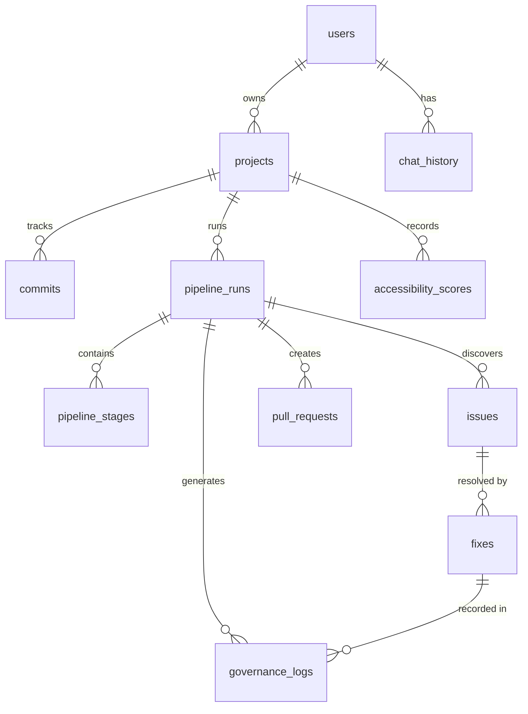

# AccessDiff — Database Schema

> Supabase PostgreSQL schema with Row Level Security

---

## 1. Entity Relationship Diagram



---

## 2. Table Definitions

### 2.1 `users`

Extends Supabase `auth.users`. Stores additional profile data and GitHub tokens.

```sql
CREATE TABLE public.users (
  id              UUID PRIMARY KEY REFERENCES auth.users(id) ON DELETE CASCADE,
  github_username TEXT NOT NULL,
  display_name    TEXT,
  avatar_url      TEXT,
  github_token    TEXT NOT NULL,  -- Encrypted GitHub OAuth token
  preferences     JSONB DEFAULT '{
    "theme": "dark",
    "language": "en",
    "notifications": true,
    "auto_approve_low_risk": false
  }'::jsonb,
  created_at      TIMESTAMPTZ DEFAULT NOW(),
  updated_at      TIMESTAMPTZ DEFAULT NOW()
);

-- Index
CREATE INDEX idx_users_github_username ON public.users(github_username);
```

### 2.2 `projects`

Imported GitHub repositories being monitored.

```sql
CREATE TABLE public.projects (
  id              UUID PRIMARY KEY DEFAULT gen_random_uuid(),
  user_id         UUID NOT NULL REFERENCES public.users(id) ON DELETE CASCADE,
  github_repo_id  BIGINT NOT NULL,
  repo_full_name  TEXT NOT NULL,        -- e.g., "user/repo-name"
  repo_url        TEXT NOT NULL,
  default_branch  TEXT DEFAULT 'main',
  description     TEXT,
  language        TEXT,                  -- Primary language
  framework       TEXT,                  -- Detected framework (e.g., "nextjs", "react", "vue")
  ai_summary      TEXT,                  -- AI-generated repository summary
  risk_areas      JSONB DEFAULT '[]'::jsonb,  -- Array of identified risk areas
  folder_structure JSONB,                -- Simplified folder tree
  accessibility_score NUMERIC(5,2) DEFAULT 0,  -- Current score (0-100)
  last_scanned_at TIMESTAMPTZ,
  is_active       BOOLEAN DEFAULT true,
  created_at      TIMESTAMPTZ DEFAULT NOW(),
  updated_at      TIMESTAMPTZ DEFAULT NOW(),

  UNIQUE(user_id, github_repo_id)
);

-- Indexes
CREATE INDEX idx_projects_user_id ON public.projects(user_id);
CREATE INDEX idx_projects_repo_full_name ON public.projects(repo_full_name);
```

### 2.3 `commits`

Tracked commits for each project.

```sql
CREATE TABLE public.commits (
  id              UUID PRIMARY KEY DEFAULT gen_random_uuid(),
  project_id      UUID NOT NULL REFERENCES public.projects(id) ON DELETE CASCADE,
  sha             TEXT NOT NULL,
  message         TEXT NOT NULL,
  author_name     TEXT,
  author_email    TEXT,
  committed_at    TIMESTAMPTZ NOT NULL,
  files_changed   INTEGER DEFAULT 0,
  additions       INTEGER DEFAULT 0,
  deletions       INTEGER DEFAULT 0,
  created_at      TIMESTAMPTZ DEFAULT NOW(),

  UNIQUE(project_id, sha)
);

-- Indexes
CREATE INDEX idx_commits_project_id ON public.commits(project_id);
CREATE INDEX idx_commits_sha ON public.commits(sha);
CREATE INDEX idx_commits_committed_at ON public.commits(project_id, committed_at DESC);
```

### 2.4 `pipeline_runs`

Each execution of the accessibility pipeline.

```sql
CREATE TYPE pipeline_status AS ENUM (
  'pending',
  'running',
  'completed',
  'failed',
  'cancelled'
);

CREATE TABLE public.pipeline_runs (
  id              UUID PRIMARY KEY DEFAULT gen_random_uuid(),
  project_id      UUID NOT NULL REFERENCES public.projects(id) ON DELETE CASCADE,
  user_id         UUID NOT NULL REFERENCES public.users(id),
  base_commit_sha TEXT NOT NULL,         -- "Before" commit
  head_commit_sha TEXT NOT NULL,         -- "After" commit
  status          pipeline_status DEFAULT 'pending',
  current_stage   TEXT,                  -- Current ADL stage name
  total_issues    INTEGER DEFAULT 0,
  new_issues      INTEGER DEFAULT 0,     -- Issues introduced by this diff
  resolved_issues INTEGER DEFAULT 0,
  fixes_generated INTEGER DEFAULT 0,
  fixes_verified  INTEGER DEFAULT 0,
  score_before    NUMERIC(5,2),
  score_after     NUMERIC(5,2),
  summary         TEXT,                  -- AI-generated summary
  error_message   TEXT,
  started_at      TIMESTAMPTZ,
  completed_at    TIMESTAMPTZ,
  created_at      TIMESTAMPTZ DEFAULT NOW(),
  updated_at      TIMESTAMPTZ DEFAULT NOW()
);

-- Indexes
CREATE INDEX idx_pipeline_runs_project_id ON public.pipeline_runs(project_id);
CREATE INDEX idx_pipeline_runs_user_id ON public.pipeline_runs(user_id);
CREATE INDEX idx_pipeline_runs_status ON public.pipeline_runs(status);
CREATE INDEX idx_pipeline_runs_created_at ON public.pipeline_runs(created_at DESC);
```

### 2.5 `pipeline_stages`

Individual stages within a pipeline run (maps to ADL stages).

```sql
CREATE TYPE stage_status AS ENUM (
  'pending',
  'running',
  'completed',
  'failed',
  'skipped'
);

CREATE TABLE public.pipeline_stages (
  id              UUID PRIMARY KEY DEFAULT gen_random_uuid(),
  pipeline_run_id UUID NOT NULL REFERENCES public.pipeline_runs(id) ON DELETE CASCADE,
  stage_name      TEXT NOT NULL,          -- e.g., "spec", "build", "evaluate", "diagnose", "optimize"
  agent_name      TEXT NOT NULL,          -- e.g., "RepositoryAgent", "GitDiffAgent"
  status          stage_status DEFAULT 'pending',
  input_data      JSONB,                  -- What was fed to this stage
  output_data     JSONB,                  -- What this stage produced
  error_message   TEXT,
  duration_ms     INTEGER,
  started_at      TIMESTAMPTZ,
  completed_at    TIMESTAMPTZ,
  created_at      TIMESTAMPTZ DEFAULT NOW(),

  UNIQUE(pipeline_run_id, stage_name, agent_name)
);

-- Index
CREATE INDEX idx_pipeline_stages_run_id ON public.pipeline_stages(pipeline_run_id);
```

### 2.6 `issues`

Accessibility issues detected by the pipeline.

```sql
CREATE TYPE issue_severity AS ENUM (
  'critical',
  'major',
  'minor',
  'advisory'
);

CREATE TYPE issue_status AS ENUM (
  'open',
  'fix_generated',
  'fix_verified',
  'fix_approved',
  'fix_rejected',
  'resolved',
  'wont_fix'
);

CREATE TABLE public.issues (
  id                    UUID PRIMARY KEY DEFAULT gen_random_uuid(),
  pipeline_run_id       UUID NOT NULL REFERENCES public.pipeline_runs(id) ON DELETE CASCADE,
  project_id            UUID NOT NULL REFERENCES public.projects(id) ON DELETE CASCADE,

  -- Location
  file_path             TEXT NOT NULL,
  line_number           INTEGER,
  column_number         INTEGER,
  code_snippet          TEXT,              -- The offending code

  -- Classification
  severity              issue_severity NOT NULL,
  status                issue_status DEFAULT 'open',
  is_regression         BOOLEAN DEFAULT true,  -- Was this introduced by this diff?

  -- WCAG
  wcag_rule             TEXT NOT NULL,       -- e.g., "2.1.1"
  wcag_rule_name        TEXT,               -- e.g., "Keyboard"
  wcag_level            TEXT,               -- "A", "AA", "AAA"

  -- AI Analysis
  title                 TEXT NOT NULL,
  description           TEXT NOT NULL,
  confidence            NUMERIC(5,2) NOT NULL,  -- 0-100
  affected_users        TEXT,               -- Description of who is affected
  technical_explanation TEXT,
  business_impact       TEXT,
  accessibility_impact  TEXT,
  expected_improvement  TEXT,

  -- Detection Source
  detected_by           TEXT NOT NULL,       -- "axe-core", "lighthouse", "ai-reasoning"
  raw_rule_id           TEXT,               -- Original rule ID from axe/lighthouse

  created_at            TIMESTAMPTZ DEFAULT NOW(),
  updated_at            TIMESTAMPTZ DEFAULT NOW()
);

-- Indexes
CREATE INDEX idx_issues_pipeline_run_id ON public.issues(pipeline_run_id);
CREATE INDEX idx_issues_project_id ON public.issues(project_id);
CREATE INDEX idx_issues_severity ON public.issues(severity);
CREATE INDEX idx_issues_status ON public.issues(status);
CREATE INDEX idx_issues_wcag_rule ON public.issues(wcag_rule);
CREATE INDEX idx_issues_is_regression ON public.issues(is_regression);
```

### 2.7 `fixes`

AI-generated fixes for issues.

```sql
CREATE TYPE fix_status AS ENUM (
  'generated',
  'verifying',
  'verified',
  'failed_verification',
  'approved',
  'rejected',
  'applied',
  'rolled_back'
);

CREATE TYPE risk_level AS ENUM (
  'low',
  'medium',
  'high'
);

CREATE TABLE public.fixes (
  id                UUID PRIMARY KEY DEFAULT gen_random_uuid(),
  issue_id          UUID NOT NULL REFERENCES public.issues(id) ON DELETE CASCADE,
  pipeline_run_id   UUID NOT NULL REFERENCES public.pipeline_runs(id) ON DELETE CASCADE,

  -- Fix Content
  file_path         TEXT NOT NULL,
  before_code       TEXT NOT NULL,         -- Original code
  after_code        TEXT NOT NULL,          -- Fixed code
  diff_patch        TEXT NOT NULL,          -- Git-compatible unified diff

  -- Metadata
  status            fix_status DEFAULT 'generated',
  risk_level        risk_level DEFAULT 'low',
  trust_score       NUMERIC(5,2),          -- 0-100
  confidence        NUMERIC(5,2),          -- 0-100
  reasoning         TEXT,                  -- Why this fix was chosen
  iteration         INTEGER DEFAULT 1,     -- Which attempt (max 3)

  -- Verification
  verification_result JSONB,               -- Results of re-running analysis
  verified_at       TIMESTAMPTZ,

  -- Approval
  approved_by       UUID REFERENCES public.users(id),
  approved_at       TIMESTAMPTZ,
  rejection_reason  TEXT,

  -- Rollback
  rolled_back       BOOLEAN DEFAULT false,
  rolled_back_at    TIMESTAMPTZ,

  created_at        TIMESTAMPTZ DEFAULT NOW(),
  updated_at        TIMESTAMPTZ DEFAULT NOW()
);

-- Indexes
CREATE INDEX idx_fixes_issue_id ON public.fixes(issue_id);
CREATE INDEX idx_fixes_pipeline_run_id ON public.fixes(pipeline_run_id);
CREATE INDEX idx_fixes_status ON public.fixes(status);
```

### 2.8 `governance_logs`

Complete audit trail of every AI decision.

```sql
CREATE TABLE public.governance_logs (
  id              UUID PRIMARY KEY DEFAULT gen_random_uuid(),
  pipeline_run_id UUID REFERENCES public.pipeline_runs(id) ON DELETE CASCADE,
  project_id      UUID NOT NULL REFERENCES public.projects(id) ON DELETE CASCADE,
  fix_id          UUID REFERENCES public.fixes(id) ON DELETE SET NULL,

  -- Agent Info
  agent_name      TEXT NOT NULL,
  action          TEXT NOT NULL,            -- e.g., "fix_generated", "verification_passed", "rollback"

  -- Decision Data
  reasoning       TEXT NOT NULL,
  confidence      NUMERIC(5,2) NOT NULL,
  trust_score     NUMERIC(5,2),
  risk_level      risk_level,

  -- Verification
  verification_status TEXT,                -- "passed", "failed", "pending"
  approval_status     TEXT,                -- "approved", "rejected", "pending"

  -- Context
  input_data      JSONB,                   -- What was provided to the agent
  output_data     JSONB,                   -- What the agent produced
  before_code     TEXT,
  after_code      TEXT,
  wcag_rule       TEXT,
  file_path       TEXT,

  -- Rollback
  is_rollback     BOOLEAN DEFAULT false,
  rollback_of     UUID REFERENCES public.governance_logs(id),

  created_at      TIMESTAMPTZ DEFAULT NOW()
);

-- Indexes
CREATE INDEX idx_governance_logs_pipeline_run_id ON public.governance_logs(pipeline_run_id);
CREATE INDEX idx_governance_logs_project_id ON public.governance_logs(project_id);
CREATE INDEX idx_governance_logs_agent_name ON public.governance_logs(agent_name);
CREATE INDEX idx_governance_logs_created_at ON public.governance_logs(created_at DESC);
```

### 2.9 `accessibility_scores`

Historical accessibility scores for timeline visualization.

```sql
CREATE TABLE public.accessibility_scores (
  id              UUID PRIMARY KEY DEFAULT gen_random_uuid(),
  project_id      UUID NOT NULL REFERENCES public.projects(id) ON DELETE CASCADE,
  pipeline_run_id UUID REFERENCES public.pipeline_runs(id) ON DELETE SET NULL,
  commit_sha      TEXT NOT NULL,
  score           NUMERIC(5,2) NOT NULL,   -- 0-100
  total_issues    INTEGER DEFAULT 0,
  critical_issues INTEGER DEFAULT 0,
  major_issues    INTEGER DEFAULT 0,
  minor_issues    INTEGER DEFAULT 0,
  advisory_issues INTEGER DEFAULT 0,
  measured_at     TIMESTAMPTZ DEFAULT NOW(),

  UNIQUE(project_id, commit_sha)
);

-- Indexes
CREATE INDEX idx_scores_project_id ON public.accessibility_scores(project_id);
CREATE INDEX idx_scores_measured_at ON public.accessibility_scores(project_id, measured_at DESC);
```

### 2.10 `pull_requests`

GitHub Pull Requests created by the platform.

```sql
CREATE TABLE public.pull_requests (
  id              UUID PRIMARY KEY DEFAULT gen_random_uuid(),
  pipeline_run_id UUID NOT NULL REFERENCES public.pipeline_runs(id) ON DELETE CASCADE,
  project_id      UUID NOT NULL REFERENCES public.projects(id) ON DELETE CASCADE,
  user_id         UUID NOT NULL REFERENCES public.users(id),

  github_pr_number INTEGER NOT NULL,
  github_pr_url   TEXT NOT NULL,
  title           TEXT NOT NULL,
  body            TEXT NOT NULL,           -- Markdown PR body
  status          TEXT DEFAULT 'open',     -- "open", "merged", "closed"
  files_modified  INTEGER DEFAULT 0,
  issues_addressed INTEGER DEFAULT 0,
  score_improvement NUMERIC(5,2),

  created_at      TIMESTAMPTZ DEFAULT NOW(),
  updated_at      TIMESTAMPTZ DEFAULT NOW()
);

-- Indexes
CREATE INDEX idx_pull_requests_pipeline_run_id ON public.pull_requests(pipeline_run_id);
CREATE INDEX idx_pull_requests_project_id ON public.pull_requests(project_id);
```

### 2.11 `chat_history`

Sarvam AI assistant conversation history.

```sql
CREATE TABLE public.chat_history (
  id              UUID PRIMARY KEY DEFAULT gen_random_uuid(),
  user_id         UUID NOT NULL REFERENCES public.users(id) ON DELETE CASCADE,
  project_id      UUID REFERENCES public.projects(id) ON DELETE SET NULL,

  role            TEXT NOT NULL CHECK (role IN ('user', 'assistant')),
  content         TEXT NOT NULL,
  language        TEXT DEFAULT 'en',
  context         JSONB,                   -- Current file, issue, pipeline state
  audio_url       TEXT,                    -- For voice messages

  created_at      TIMESTAMPTZ DEFAULT NOW()
);

-- Indexes
CREATE INDEX idx_chat_history_user_id ON public.chat_history(user_id);
CREATE INDEX idx_chat_history_project_id ON public.chat_history(project_id);
CREATE INDEX idx_chat_history_created_at ON public.chat_history(created_at DESC);
```

---

## 3. Row Level Security Policies

All tables enforce user-level data isolation via RLS.

```sql
-- Enable RLS on all tables
ALTER TABLE public.users ENABLE ROW LEVEL SECURITY;
ALTER TABLE public.projects ENABLE ROW LEVEL SECURITY;
ALTER TABLE public.commits ENABLE ROW LEVEL SECURITY;
ALTER TABLE public.pipeline_runs ENABLE ROW LEVEL SECURITY;
ALTER TABLE public.pipeline_stages ENABLE ROW LEVEL SECURITY;
ALTER TABLE public.issues ENABLE ROW LEVEL SECURITY;
ALTER TABLE public.fixes ENABLE ROW LEVEL SECURITY;
ALTER TABLE public.governance_logs ENABLE ROW LEVEL SECURITY;
ALTER TABLE public.accessibility_scores ENABLE ROW LEVEL SECURITY;
ALTER TABLE public.pull_requests ENABLE ROW LEVEL SECURITY;
ALTER TABLE public.chat_history ENABLE ROW LEVEL SECURITY;

-- Users: can only read/update own profile
CREATE POLICY "Users can view own profile"
  ON public.users FOR SELECT
  USING (auth.uid() = id);

CREATE POLICY "Users can update own profile"
  ON public.users FOR UPDATE
  USING (auth.uid() = id);

-- Projects: can only access own projects
CREATE POLICY "Users can CRUD own projects"
  ON public.projects FOR ALL
  USING (auth.uid() = user_id);

-- Commits: access if user owns the project
CREATE POLICY "Users can access own project commits"
  ON public.commits FOR ALL
  USING (
    project_id IN (
      SELECT id FROM public.projects WHERE user_id = auth.uid()
    )
  );

-- Pipeline Runs: access if user owns the project
CREATE POLICY "Users can access own pipeline runs"
  ON public.pipeline_runs FOR ALL
  USING (auth.uid() = user_id);

-- Pipeline Stages: access via pipeline run ownership
CREATE POLICY "Users can access own pipeline stages"
  ON public.pipeline_stages FOR ALL
  USING (
    pipeline_run_id IN (
      SELECT id FROM public.pipeline_runs WHERE user_id = auth.uid()
    )
  );

-- Issues: access via project ownership
CREATE POLICY "Users can access own project issues"
  ON public.issues FOR ALL
  USING (
    project_id IN (
      SELECT id FROM public.projects WHERE user_id = auth.uid()
    )
  );

-- Fixes: access via pipeline run ownership
CREATE POLICY "Users can access own fixes"
  ON public.fixes FOR ALL
  USING (
    pipeline_run_id IN (
      SELECT id FROM public.pipeline_runs WHERE user_id = auth.uid()
    )
  );

-- Governance Logs: access via project ownership
CREATE POLICY "Users can access own governance logs"
  ON public.governance_logs FOR ALL
  USING (
    project_id IN (
      SELECT id FROM public.projects WHERE user_id = auth.uid()
    )
  );

-- Accessibility Scores: access via project ownership
CREATE POLICY "Users can access own scores"
  ON public.accessibility_scores FOR ALL
  USING (
    project_id IN (
      SELECT id FROM public.projects WHERE user_id = auth.uid()
    )
  );

-- Pull Requests: access via user ownership
CREATE POLICY "Users can access own PRs"
  ON public.pull_requests FOR ALL
  USING (auth.uid() = user_id);

-- Chat History: access own messages only
CREATE POLICY "Users can access own chat history"
  ON public.chat_history FOR ALL
  USING (auth.uid() = user_id);
```

---

## 4. Database Functions

### 4.1 Auto-update `updated_at` Trigger

```sql
CREATE OR REPLACE FUNCTION update_updated_at_column()
RETURNS TRIGGER AS $$
BEGIN
  NEW.updated_at = NOW();
  RETURN NEW;
END;
$$ LANGUAGE plpgsql;

-- Apply to tables with updated_at
CREATE TRIGGER update_users_updated_at
  BEFORE UPDATE ON public.users
  FOR EACH ROW EXECUTE FUNCTION update_updated_at_column();

CREATE TRIGGER update_projects_updated_at
  BEFORE UPDATE ON public.projects
  FOR EACH ROW EXECUTE FUNCTION update_updated_at_column();

CREATE TRIGGER update_pipeline_runs_updated_at
  BEFORE UPDATE ON public.pipeline_runs
  FOR EACH ROW EXECUTE FUNCTION update_updated_at_column();

CREATE TRIGGER update_issues_updated_at
  BEFORE UPDATE ON public.issues
  FOR EACH ROW EXECUTE FUNCTION update_updated_at_column();

CREATE TRIGGER update_fixes_updated_at
  BEFORE UPDATE ON public.fixes
  FOR EACH ROW EXECUTE FUNCTION update_updated_at_column();

CREATE TRIGGER update_pull_requests_updated_at
  BEFORE UPDATE ON public.pull_requests
  FOR EACH ROW EXECUTE FUNCTION update_updated_at_column();
```

### 4.2 Auto-create User Profile on Signup

```sql
CREATE OR REPLACE FUNCTION handle_new_user()
RETURNS TRIGGER AS $$
BEGIN
  INSERT INTO public.users (id, github_username, display_name, avatar_url, github_token)
  VALUES (
    NEW.id,
    NEW.raw_user_meta_data->>'user_name',
    NEW.raw_user_meta_data->>'full_name',
    NEW.raw_user_meta_data->>'avatar_url',
    '' -- Token populated separately after OAuth
  );
  RETURN NEW;
END;
$$ LANGUAGE plpgsql SECURITY DEFINER;

CREATE TRIGGER on_auth_user_created
  AFTER INSERT ON auth.users
  FOR EACH ROW EXECUTE FUNCTION handle_new_user();
```

---

## 5. Migration Strategy

- All schema changes are tracked as numbered migrations in `supabase/migrations/`
- Naming convention: `YYYYMMDDHHMMSS_description.sql`
- Run via `supabase db push` (dev) or `supabase db migrate` (production)

---

*Document Version: 1.0*
*Last Updated: 2026-08-04*
*Status: DRAFT — Awaiting Review*
